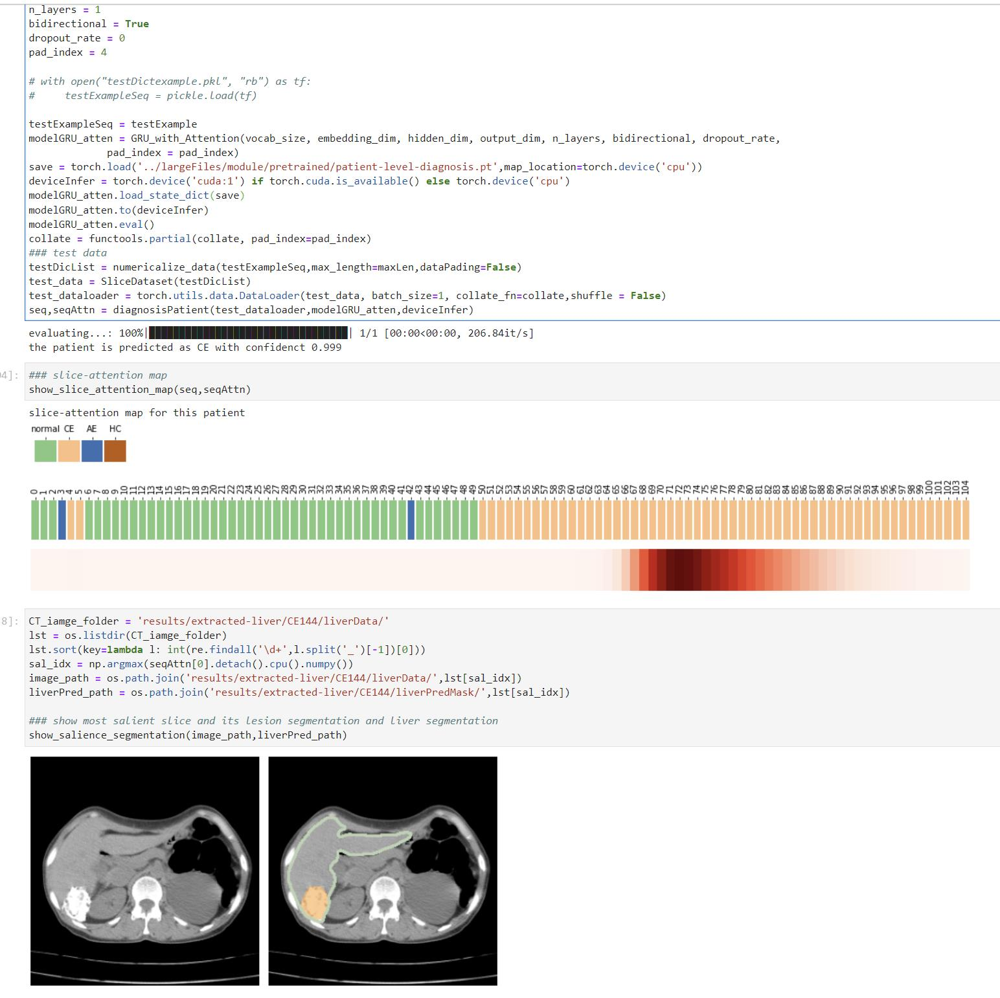

## Brief summay

EDAM could diagnose and subtype hepatic echinococcosis (HE) patients at the patient level using plain CT images as input. 

You can use EDAM in two ways, slice-level prediction (diagnosing and generating segmentation for a single slice), and patient-level diagnosis (diagnosing a person based on the 3D CT image).

## Data
* CT images in `.nii` format should be placed under `data-input/patient-example/`. We provide an example of a CT image of a patient diagnosed as hepatic cysts (CE). This is an example for patient-level diagnosis.
* CT slices in `.png` format should be placed under `data-input/slice-example/`. We provide an example of a CT slice extracted from the CT image. This is used for slice-level prediction.
* All outputs and temp outputs (liver segmentation, lesion segmentation, and slice attention map) are stored under `results/`.

## Pre-requisites and Environment

### Our Environment
* Linux
* NVIDIA GPU (Tested on Nvidia GeForce RTX 3090 x 4)
* Python (3.7.9), Imageio (2.16.1), Matplotlib (3.5.1), Numpy (1.21.2), pencv_python (4.5.5.64), Pillow (9.2.0), Scikit_image (0.19.2), Scikit_learn (1.1.2), Scipy (1.7.3), Seaborn (0.11.2), SimpleITK (2.2.0), Skimage (0.0), Torch (1.11.0), Torchvision (0.12.0),  Tqdm (4.63.0).
### Environment Configuration

1. Create a virtual environment and install PyTorch. In the 3rd step, please select the correct Pytorch version that matches your CUDA version from https://pytorch.org/get-started/previous-versions/.

```
$ conda create -n EDAM python=3.7.9
$ conda activate EDAM
$ pip3 install torch torchvision torchaudio --extra-index-url https://download.pytorch.org/whl/cu113
```

Note: `pip install` command is required for Pytorch installation.

2. To try out the Python code and set up environment, please activate the `EDAM` environment first:
```
$ conda activate pathfinder
$ cd EDAM/
```
For ease of use, you can just set up the environment and run the following:
```
$ pip install -r requirements.txt
```

## EDAM diagnosing

### Paient diagnosis

#### Liver segmentation and allocation

* 3D CT images, which stored as `.nii` files under `data-input/patient-example/`, are first processed by the liver segmentaton model, to generate masks of liver field. The segmentation map and the CT slices within liver field would be generated and saved under `results/extracted-liver/filename/`. The process can be done by calling:

```
$ python liver-segmentation.py
```

#### Patient level diagnosis

* EDAM predicts each CT slice from the above step by slice-level prediction, and generates a label sequence. Then it processes the label sequence and gives a prediction for the patient. Directly calling:
```
$ python patient-diagnosis.py
```
* EDAM also generates a slice-attention map for the CT image, which is visualised by using `show_slice_attention_map`.
* The most salient slice as well as the liver and lesion segmentation are illustrated by using `show_salience_segmentation`.

### Slice prediction

* EDAM supports the lesion segmentation and classification of single CT slice, which stored as `.png ` files under `data-input/slice-example/`, by calling:
```
$ python single-slice-prediction.py
```
### Quick Start

* We provide simple and user-friendly Jupyter notebook patient-diagnosis.ipynb as a quick diagnosing demo to visualize prediction, segmentaiton, and slice attention map.
* Please click to download pre-trained [models](https://cloud.tsinghua.edu.cn/d/9d8367eefa5a4e99a25e/), and place the file in `module/`. 
* Before you launch the notebooks, please configure an environment following the instruction in Environment Configuration.
* Then, you can launch the notebook and view the diagnosis from EDAM.




